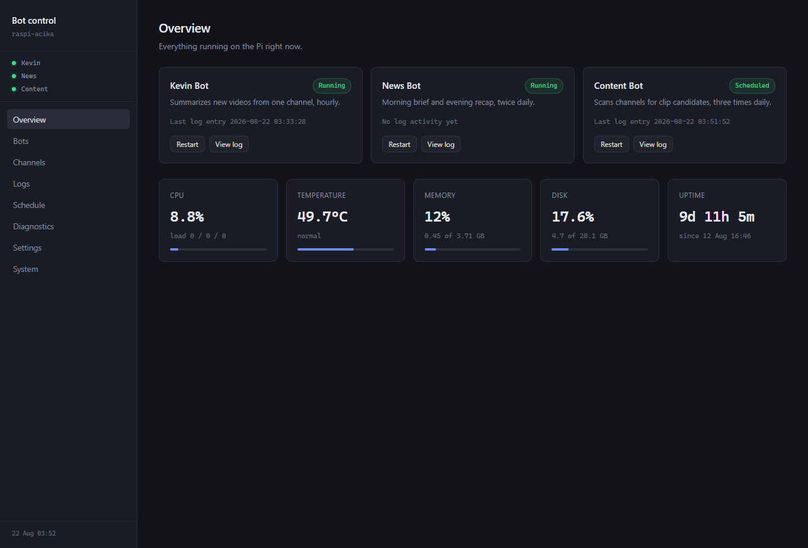

# Self-Hosted Automation Stack

Three Python automation services running continuously on a Raspberry Pi 4,
managed by systemd and controlled through a FastAPI web dashboard.

Built to solve my own workflow problems and to run reliably without cloud
hosting costs or ongoing manual maintenance.

## Services

| Service | Purpose | Schedule |
|---|---|---|
| `kevin-bot/` | Summarizes new videos from a YouTube channel using an LLM | Hourly |
| `news-bot/` | Morning brief and evening recap built from RSS feeds | 08:00, 20:00 |
| `content-bot/` | Scans multiple channels for short-form clip candidates | 3x daily |
| `dashboard/` | FastAPI control panel for every service | Always on |
| `updater/` | Patches OS and Python dependencies, restarts services | Every 5 days |
| `systemd/` | Unit and timer files for every service | — |

## Architecture

Each bot runs in an isolated virtual environment as its own systemd service,
with auto-start on boot, auto-restart on failure, and per-service logging.
`news-bot` and `content-bot` are one-shot units fired by systemd timers, so
their timing survives restarts and reboots. `kevin-bot` is resident and paces
itself in-process.

Shared pipeline:

    RSS feed -> transcript / article text -> LLM (Groq) -> email + push notification

## Engineering notes

- **Rate limit handling** — transcripts are chunked and batched to stay under
  the LLM provider's tokens-per-minute ceiling, with a pause between calls and
  a cap on how many channels a single run will touch. Per-chunk results are
  stitched back together in Python rather than by a second model call, which
  keeps every candidate and saves a request per video.
- **Config-driven design** — the dashboard builds its entire UI from a bot
  list in `config.py`; adding a service is a single entry. `content-bot`
  reads its watch list from `channels.json`, editable from the dashboard.
- **Failure handling** — an item that can't be processed is marked seen so it
  isn't retried indefinitely. `kevin-bot` pushes a failure notification;
  `content-bot` records the error in its log and moves on.
- **Editable prompts** — the wording each bot sends to the LLM lives in
  `prompts/*.txt` and is edited from the dashboard. Files are read at call
  time, so a change takes effect on the next run without restarting anything.
- **Self-maintaining** — the updater patches the OS and every virtual
  environment on a timer, restarts affected services, and flags when a
  reboot is required.

## Dashboard

A FastAPI web app on port 5000 providing live service status, start/stop/
restart controls, manual run triggers, a searchable log viewer, prompt
editing, channel management, email recipient settings, and Pi health metrics
(CPU, memory, disk, temperature, uptime). Auth is wired into every route and
toggled by a single config flag, ready for external exposure via Cloudflare
Tunnel.

## Running a service

Each bot folder needs a `.env` (see the matching `.env.example`) and its own
virtual environment. Each bot names its requirements file differently:

    python3 -m venv venv
    ./venv/bin/pip install -r *requirements*.txt

`content-bot` also needs a watch list — copy `channels.example.json` to
`channels.json`, or add channels from the dashboard once it's running.

Prompts work the same way: each bot reads `prompts/<name>.txt`, falling back to
the committed `prompts/<name>.default.txt` until you customise one from the
dashboard's Prompts page.

Then install the matching unit file from `systemd/` and enable it:

    sudo cp systemd/kevin-bot.service /etc/systemd/system/
    sudo systemctl daemon-reload
    sudo systemctl enable --now kevin-bot

## Stack

Python, FastAPI, systemd, Bash, Groq API, feedparser, SMTP, ntfy
