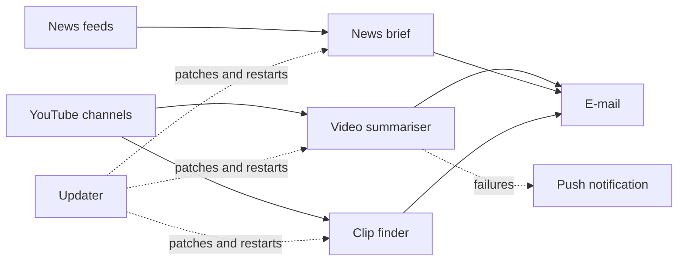

# Self-hosted automation stack

**Three small Python services that do the reading for me — a video summariser, a daily
news brief and a clip finder — plus a job that keeps the whole machine patched.**

I follow a few YouTube channels and more news than I have time for. These services watch
those sources, have a language model do the reading, and send me the result — a summary
of a video worth watching, a brief in the morning and a recap at night, and a list of
moments worth clipping. They run on a Raspberry Pi in my house rather than on rented
servers: no monthly bill, and nothing about what I read leaves the machine except the
text sent to the model.

The point of the project was not the bots. It was building something that keeps running
when I am not watching it.

## The services

| | What it does | When |
|---|---|---|
| **Video summariser** | Checks a channel for new uploads, fetches the transcript, and sends a structured summary — thesis, key points, takeaways, risks | Hourly |
| **News brief** | Builds a morning briefing and an evening recap from a set of feeds | Twice a day |
| **Clip finder** | Scans several channels for moments worth cutting into short videos, with timestamps and a reason | Three times a day |
| **Updater** | Patches the operating system and every service's dependencies, verifies each one still works, and rolls back if not | Every five days |

A separate web dashboard (its own repository) shows their status, tails their logs and
edits what they do.

## How it's built

**Each service stands alone.** Its own dependencies, its own configuration, its own
schedule, and no shared state — one breaking cannot take the others with it. Scheduling
is handed to the operating system rather than kept inside a long-running process, so the
timing survives restarts and reboots and a missed run is visible rather than silent.

**Behaviour is data, not code.** What the model is asked to do lives in plain text files,
and the list of channels to watch is a data file. Both are read at the moment they are
used, so changing the wording of a summary or adding a channel takes effect on the next
run with nothing to restart and nothing to redeploy. The dashboard edits both, which is
why they are files rather than constants.

**Working within a rate limit.** Transcripts of long videos exceed what the model will
accept in one request, and the free tier has a ceiling on tokens per minute. Transcripts
are split into chunks, sent with deliberate pauses, and the partial results are stitched
back together in ordinary Python rather than by asking the model a second time — one less
request, and nothing lost in a second round of summarising.

**Failures are expected, not exceptional.** A video with no transcript, a feed that is
down, a request that comes back rate-limited: each is caught where it happens, recorded,
and skipped so it isn't retried forever. Anything that stops a service outright triggers a
push notification to my phone.

**It maintains itself.** The updater patches the system and every service's dependencies
on a timer. Before it touches anything it records exactly what was installed; afterwards
it runs each service's own checks and confirms it is healthy, and if anything fails it
puts back the previous set of packages and tells me. Unattended updates are only
acceptable if they can undo themselves.

**Credentials stay put.** Each service keeps its own secrets, and the settings the
dashboard is allowed to change live in a separate shared file — so the panel that edits
them never needs to read a file containing API keys.

## Technology

| Layer | What's used |
|---|---|
| **Language** | Python 3, plus Bash for the updater |
| **Scheduling and supervision** | systemd services and timers: auto-start, auto-restart, per-service logs |
| **Language model** | Groq API, with chunking and rate-limit handling |
| **Sources** | YouTube transcripts and RSS feeds |
| **Delivery** | SMTP e-mail, ntfy push notifications |
| **Host** | Raspberry Pi 4 |

## Status

Running continuously since August 2026 and sending daily. The pieces I would build
differently next time are in the dashboard's repository, which was rewritten from scratch
once this stack outgrew its first control panel.
